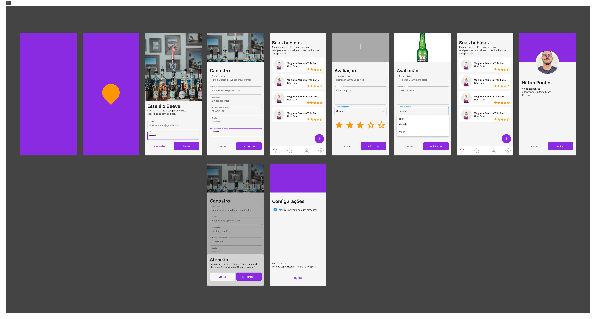

# beeve

App que permite aos usuários cadastrarem, avaliarem e compartilharem suas avaliações de variadas bebidas (alcoólicas ou não).

## Tecnologias

Algumas das tecnologias e bibliotecas utilizadas neste projeto foram:

* Backend: Node.js, Nest, Prisma, MySQL e Docker;
* Frontend: React.js, Next.js, ChakraUI, entre outras;
* Mobile: React Native, Expo, React-native-reanimated, entre outras.

## Figma

O Figma do projeto é: https://www.figma.com/design/Rw1XydsCwxxLFmPSTYW0Vs/Bubble-Solutions?node-id=418-2

## Download & develop

As instruções para cada uma das camadas do software (backend, frontend e mobile) estão em seus respectivos arquivos README.